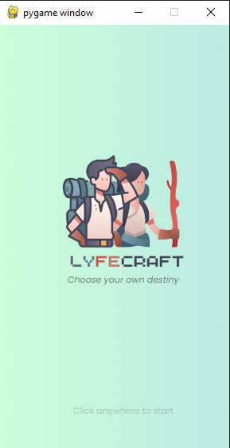
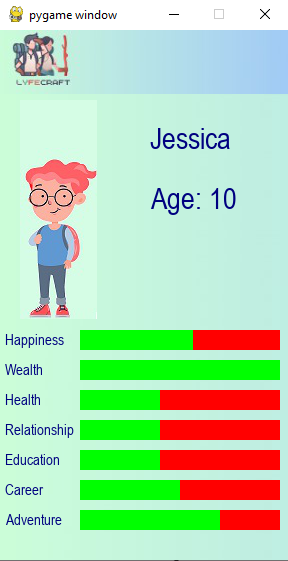
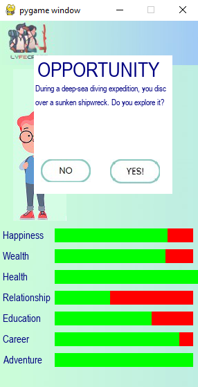

# LyfeCraft
Welcome to LyfeCraft, an innovative life simulation game where players embark on a thrilling journey through the highs and lows of virtual life. With dynamic decision-making, immersive storytelling, and personalized experiences, LyfeCraft offers an unparalleled gaming experience.

## Features
- Personalized Experiences: Customize every aspect of your virtual character, from appearance to life goals.
- Dynamic Decision-Making: Every choice influences your character's journey and outcomes, leading to a wide range of possibilities and consequences.
- Immersive Storytelling: Craft compelling stories filled with drama, adventure, romance, and triumph.
- Exploration and Discovery: Embark on new adventures, pursue passions, and build relationships in a rich and immersive world.
- (next update) Social Interaction: Connect with friends, share achievements, and influence each other's narratives.
- (next update) Achievements and Milestones: Strive for progress and success as you unlock new life stages, achieve personal goals, and overcome challenges.

## Download Details
1. Clone game into local files
2. Install pygame (if pip install does not work, try using python3 wrapper, python3 -m pip install -U pygame)
3. Install playsound (python3 -m pip install playsound)
4. Install openpyxl (python3 -m pip install openpyxl)
5. run main.py
Note: if you run into an error with playsound, you may need to try these:
- error in installation: upgrade wheel (python3 -m pip install --upgrade wheel)
- error is The specified device is not open or is not recognized by MCI or Error 259 for command: uninstall and reinstall version 1.2.2 (python3 -m pip uninstall playsound, python3 -m pip install playsound==1.2.2)

## To do list (for myself):
- create an additional page for users to input their name and gender and character preference: https://stackoverflow.com/questions/46390231/how-can-i-create-a-text-input-box-with-pygame
- add a end screen for what happens after the character is too old 
- fix up UI to make it look less blocky 